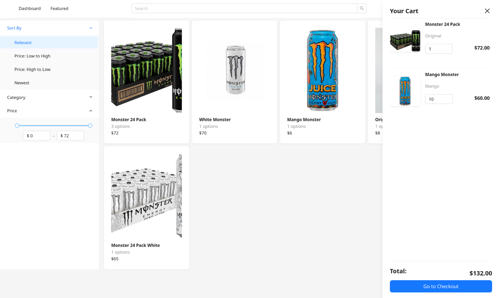
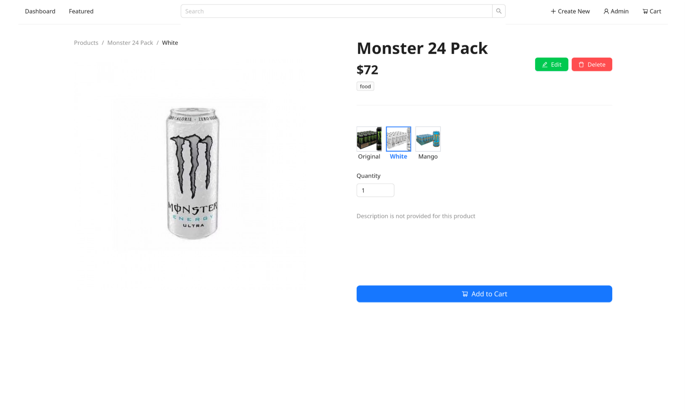
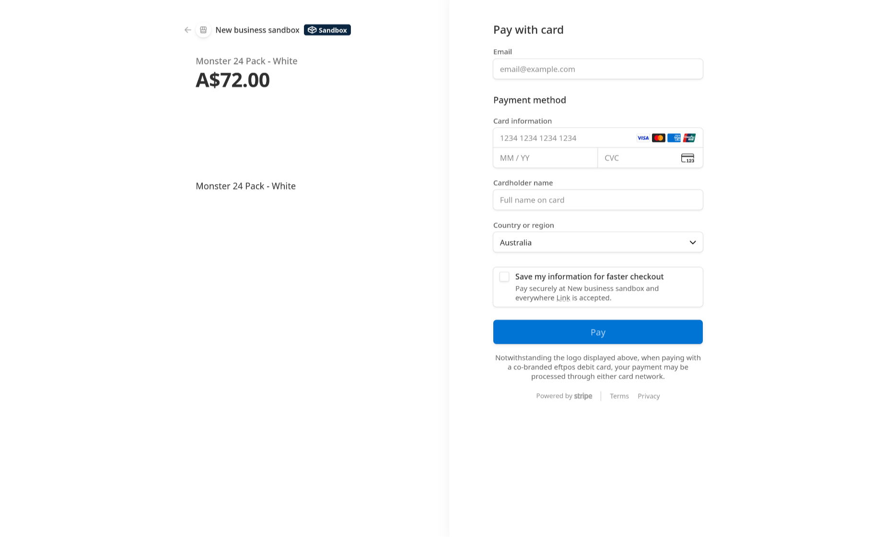
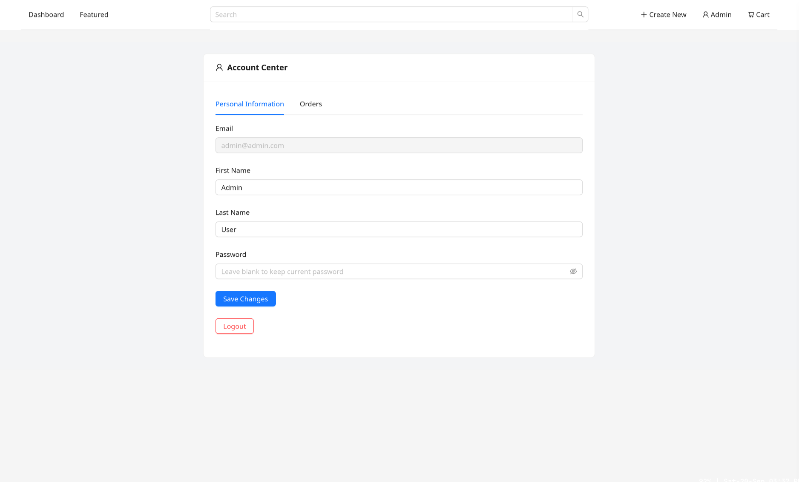
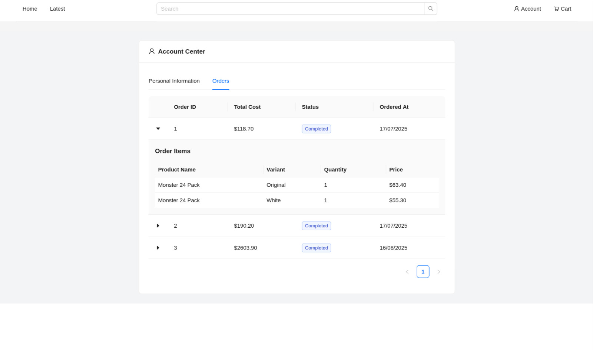
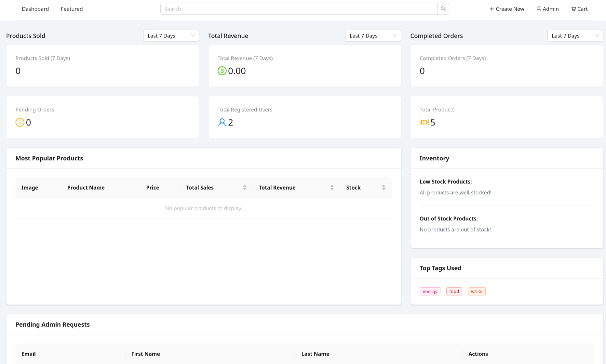
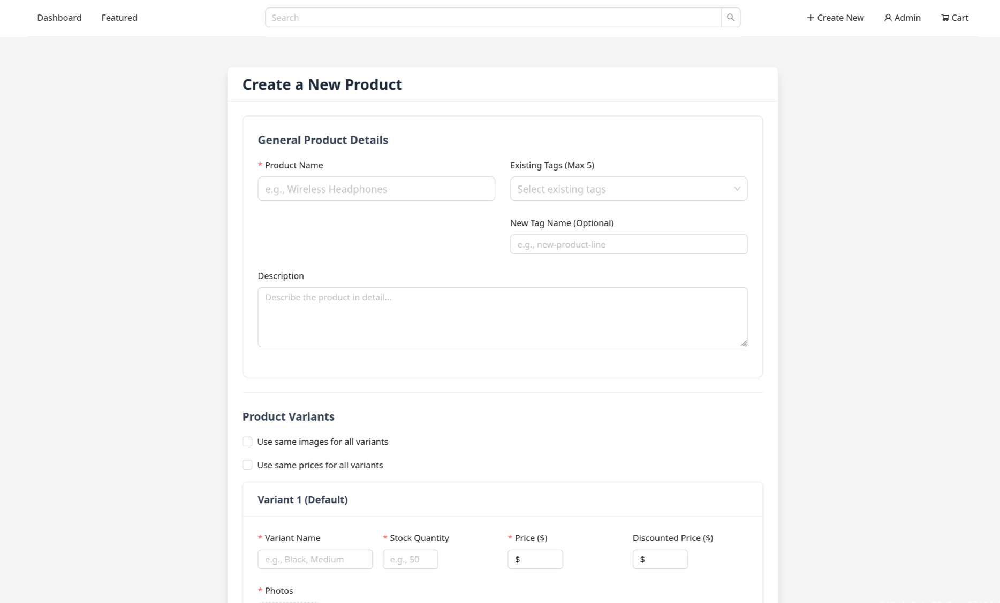
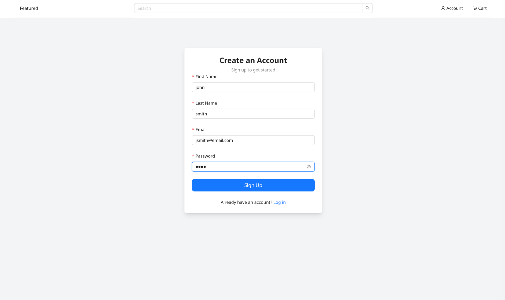

# Online Shop
## Showcase

## Features
**Customers can**:
1. Browse through available products without an account
2. Purchase items from their cart, via the Stripe api
3. View past orders and current order status
4. Update personal details

**Admins can**:
1. Do everything a customer can
2. Create a new product, detailing its price, stock, tags, etc.
3. Add variants for each product (e.g a T-shirt can have options S, M, L or XL)
4. Add variants with different photos and prices for each product (e.g multiple flavours of the same drink)
5. Edit and delete pre-existing products
6. Access to the dashboard, viewing details such as revenue, low stocked products, most popular products, pending admin requests, etc.

## Technologies used
* Stripe API for checkout
* Postgresql database
* JWT authentication
* Typescript
* C# Asp net core backend
* Vite + React + Tailwindcss frontend
* local file storage for images
